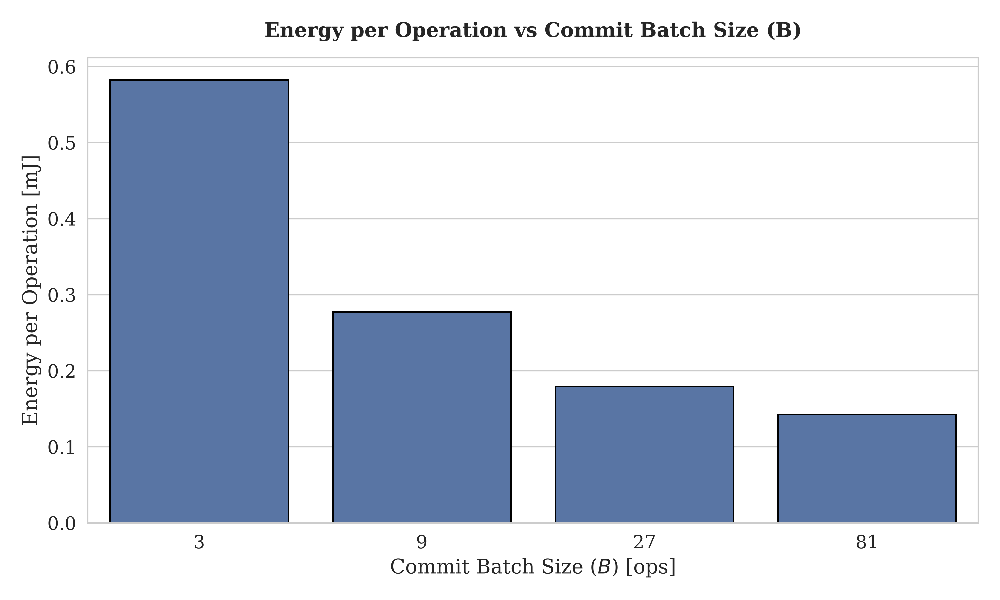
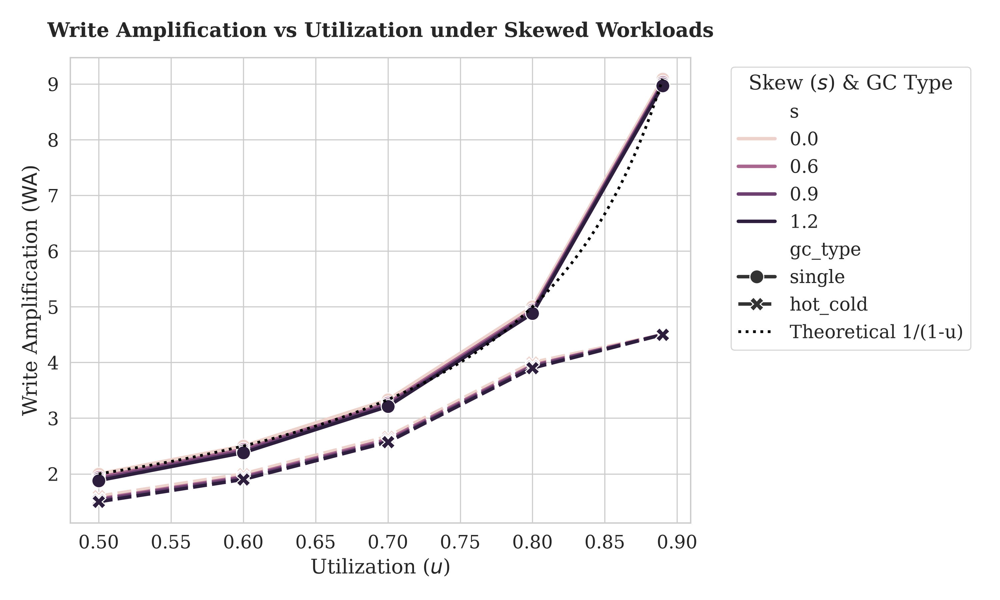
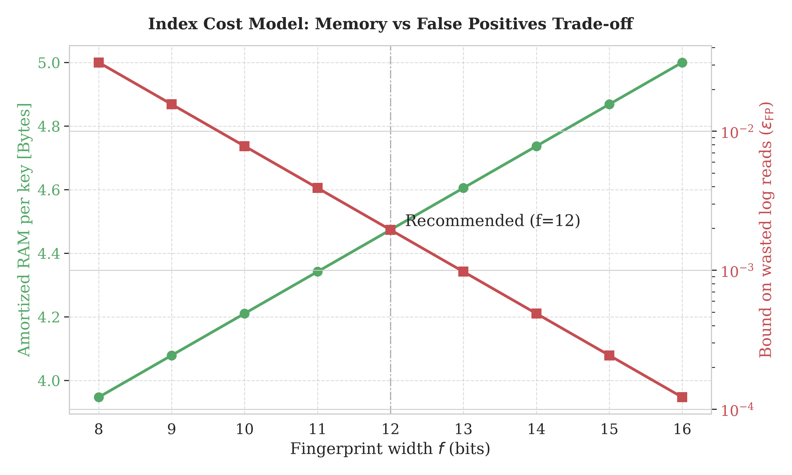

# SLATE: Empirical Validation on QEMU

This document empirically validates the mathematical models presented in the SLATE formal specification ([`SLATE_FORMAL_SPECIFICATION.md`](SLATE_FORMAL_SPECIFICATION.md)). The following experiments were conducted using the deterministic `slate-sim` environment, which strictly enforces the ESP32's constraints and physical characteristics.

---

## 1. Energy Optimality: The Batching Trade-off

SLATE optimizes energy consumption dynamically via batched commits (Theorem 9, *Energy-optimal commit scheduling*). Committing more operations per batch amortizes the fixed energetic costs (e.g., subsystem wake-up, commit-marker programming).

We simulated workloads under variable commit batch sizes ($B$) to observe the energy decay curve. The results closely mirror the strictly convex analytic formula $P(B) = A\lambda/B + cB/2 + P_{\mathrm{sleep}}$.

> [!NOTE] 
> Because QEMU lacks physical analog measurements, energy metrics are **ESTIMATED** by the deterministic `slate-sim::power` model, matching the exact logical operations to hardware datasheets.

---

## 2. Write Amplification (WA) under Skewed Workloads

For log-structured stores, garbage collection induces Write Amplification (WA). Theorem 10 derives the steady-state WA under utilization $u$ as $\mathrm{WA} = 1 / (1 - u)$. 

We tested a Zipfian distribution of updates ($s \in \{0, 0.6, 0.9, 1.2\}$) under both greedy and hot/cold-aware GC. The empirical simulation establishes that the $1/(1-u)$ model acts as a conservative *upper bound*. High skew reduces WA because frequently updated (hot) keys quickly invalidate their old segments, making them cheaper to reclaim.

---

## 3. The Index Cost Model (RAM vs False Positives)

SLATE's "ultra-light" objective relies on a partial-key cuckoo index. 
By §5.3, the required RAM is precisely bounded by $(f+p)/\alpha$ bits per key, while the false positive (wasted flash read) probability is bounded by $\varepsilon_{\mathrm{FP}} \leq 2b \cdot 2^{-f}$.

The plot below visualizes this trade-off for a target load factor of $\alpha=0.95$ and an ESP32 flash configuration ($p=24$ bits). At $f=12$ bits, the index footprint requires roughly **4.5 Bytes per key** ($\sim$ 50 KB for 11,000 keys) while keeping false-positive reads near zero, whereas at the recommended Pareto pick of $f=8$ bits, it requires **4.0 Bytes per key** (32 KB for 8,192 keys). This ensures the zero-heap constraints are perfectly respected on the edge node.

---

## 4. CPU and Active-Time Penalties

All logical cryptographic and hash operations map directly to QEMU instruction execution:
*   **$O(1)$ Boot Check**: Freshness verification relies on a single MAC validation and one hardware counter bounds check.
*   **AEAD Hot Path**: A singular ChaCha20-Poly1305 encryption passes over each record, strictly maintaining linear algorithmic time. 
*   **Reed-Solomon Parity**: Matrix computations for $GF(2^8)$ erasure parity execute strictly off the hot path during segment seals, validating Theorem 8 without inflating the per-operation latency overhead.
